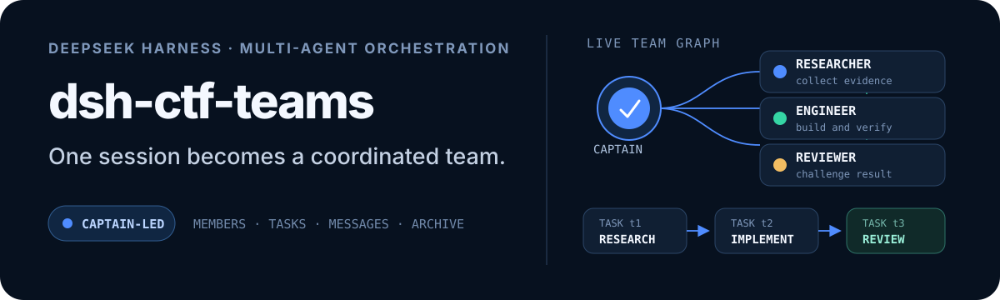

<p align="right">
  <strong>English</strong> · <a href="./README_ZH.md">简体中文</a>
</p>

<p align="center">
  
</p>

# dsh-ctf-teams

**CTFTeams** for DeepSeek Harness — a fork of [dsh-agent-teams](https://github.com/NanmiCoder/dsh-agent-teams) rebuilt for CTF. One session becomes the **captain** and dispatches a squad of full-stack CTF experts (web, pwn, reverse, crypto, forensics, misc — every agent covers every domain). They attack the challenge **in parallel from different angles**, sync progress **every round**, track candidate flags on a shared board, and render the whole solve through a **terminal dashboard**.

## Why

A real CTF solve is a race on several fronts at once. CTFTeams keeps the agent-teams machinery (durable continuable members, task DAG with dependencies, mailboxes, two-phase plan approval, quality gates) and adds the parts CTF actually needs:

- **A selectable agent mode** — the bundle also declares the `ctf-teams` Harness **agent preset** (`CTF 团队模式`), so the squad is a mode you pick in the app (session mode picker / Settings → General default preset) rather than a tool set you have to remember. The mode composes a full agent plane (shell, filesystem, skills, delegation, plan mode, compaction) plus a CTF captain persona; the `ctf_teams_*` tools come from the profile-wide host row and stay callable in every mode.
- **`ctf-teams` team profile** — a built-in, zero-config squad definition: `/ctf-teams <challenge>` dispatches four interchangeable full-stack experts at the challenge and the captain plans the attack graph.
- **Round-sync protocol** — every meaningful result is published to a shared findings board; members pull their delta with one call, the scheduler attaches new findings to every task assignment and pushes digests to idle members. A round with no new progress costs nothing.
- **Evidence-gated flags** — candidates are submitted with reproducible evidence, validated against the challenge's flag format, deduplicated, and only the captain records the platform verdict. A verified flag flips the whole team into writeup mode.
- **Shipped knowledge base** — kali toolbox, pwntools, SageMath, Volatility 3, per-domain playbooks (web / pwn / reverse / crypto / forensics / misc), and a fresh-PoC/CVE hunting workflow, readable in-session via `ctf_teams_knowledge`.
- **Toolchain service** — `ctf_teams_env` probes the machine for every managed tool (pwntools, volatility3, sage, gdb, nmap, hashcat, tshark, exiftool, …) with versions, then installs the missing ones from a curated apt/pip/brew/gem map — argv-by-argv, no shell. Heavy tools (sage, ghidra, pwndbg) report their manual command instead.
- **Reference library, pre-provisioned** — the small PoC/skill repos (ctf-skills, Awesome-POC) clone automatically when a team is created; `ctf_teams_references` syncs the rest (exphub, 0xMarcio pocindex/cve, trickest/cve, PoC-in-GitHub, cvelistV5) on demand into `<workspace>/.ctf-teams/references/` and hands each agent the absolute paths + `rg` hints, so N-day hunting works offline before any web search.
- **Live dashboard tab, and it is operable** — a `解题面板` view next to 对话 / 轨迹: challenge header, task progress bar, member lanes with live activity and unseen-board badges, the finding feed, the flag board and the host-computed `Next` line, refreshed every 1.5 s from a trust-gated route. Its controls drive the solve — 开始解题 (challenge form), 批准并运行, 推进一轮, 暂停 / 继续, 核对 flag, 附件 (workspace file picker), 写 WRITEUP, 导出 WP / 导出复盘 — and each click becomes exactly one user turn, so the captain agent stays the only writer of team state.
- **Terminal dashboard** — the same picture in the harness transcript, for surfaces without the tab: `ctf_teams_status` (model + human) and `/ctf-teams-board` (human only, zero model turns).

## Quick start

**DeepSeek Harness Desktop (primary target):** open 「Plugins → Add Plugin」 in the app sidebar, enter the package name and version (`@nanmicoder/dsh-ctf-teams`), click enable, and restart the app when the host asks. The desktop app ships its own Harness kernel and package manager, so it manages its own profiles.

**CLI / Web:**

```bash
dsh plugin --profile <name> add @nanmicoder/dsh-ctf-teams
```

(Replace `<name>` with your CLI profile; restart the profile's Harness process after installing.) The bundle ships two patch layers — the plugin row and the `ctf-teams` agent preset — and both are read when the composition loads, so **restart the Host / Desktop app** after installing or upgrading, then pick the mode:

- Desktop: choose 「CTF 团队模式」 for a new session (or set it as the default under Settings → General). A fresh install whose mode list shows no `CTF 团队模式` needs the restart, not a reinstall.
- CLI/web profile: the mode follows the same preset roster.

Then, in a session of that profile:

```
/ctf-teams solve http://chal.local:8000, attachments are in ./dist
/ctf-teams-board          # print the solving dashboard without waking the model
```

or in natural language: "Use CTFTeams to solve this pwn challenge." **Nothing to approve**: with the shipped `autoApprove: true` the captain records the challenge, submits the roster + task graph and starts dispatching in the same turn, then keeps working through reports until the flag is verified and the writeup exists. Open the **`解题面板` tab** next to 对话 / 轨迹 and watch it live. Set `autoApprove: false` in the plugin config (see [Configuration](#configuration)) to get the old two-phase flow back: the plan is staged, the Web plan card asks for approval, and 批准并运行 starts it.

## Commands

The plugin owns a closed command namespace, so the `/` menu is short and every entry means one thing:

| Command | What it does |
|---|---|
| `/ctf-teams [--profile <name>] <challenge>` | Start (or continue) a solve. Without `--profile` the configured default squad — the built-in `ctf-teams` roster — applies. |
| `/ctf-teams-board` | Print the dashboard into the transcript. No model turn, no state change. |
| `/ctf-teams-<profile>` | One alias per *other* configured team profile, so `/ctf-teams-web-only <goal>` selects that roster explicitly. |

Two generated aliases are deliberately not registered: the **default** profile's own alias (it would be `/ctf-teams` under a longer name, e.g. `ctf-teams-ctf-teams`), and any profile whose name maps onto a command this plugin already owns (`board`). Set `defaultProfile: ''` to disable the default squad and get its alias back.

## The dashboard

Two surfaces, one truth source. The **`解题面板` tab** (对话 / 轨迹 / 解题面板) is the live picture: a read-only client view that polls `GET /plugins/dsh-ctf-teams/state` every 1.5 s behind the harness browser-trust fence (an unauthenticated request gets 401, not data) and renders

- the challenge header — 🚩 solved / ◌ running, category, points, remote, attachments, flag format;
- a task progress bar plus the census (`3 完成 · 1 进行中 · 1 待办 · …`);
- member lanes with live activity, `⚡` unseen board beats, unread mail, the task they own and `done/total`;
- the newest findings with their age, the flag board with verdicts, and the **下一步 (`Next`)** line;
- a team switcher plus the archived roster for finished solves.

Polling keeps the last snapshot when the host restarts ("重连中") and pauses while the page is hidden.

### Operating from the tab

Every control queues **one user turn** and nothing else — the tab never writes team state, so the captain's protocol (staged approval, flag verdicts, attachment writes) keeps applying and the transcript shows exactly what was clicked:

| Button | When | What it sends |
|---|---|---|
| 开始解题 | no team | a challenge form (goal, profile, remote, category, points, flag format) → `/ctf-teams …` + the facts |
| 批准并运行 | a staged plan exists (captain) | `ctf_teams_approve` + dispatch ready tasks — only needed with `autoApprove: false`, or for a team staged before this release |
| 推进一轮 | running | `ctf_teams_status`, dispatch ready work, wake lanes that are behind |
| 暂停 / 继续 | running / halted (captain) | halt, or `ctf_teams_resume` with a reason |
| 核对 flag fN | a candidate exists (captain) | platform check, then `ctf_teams_mark_flag` |
| 附件 | not archived (captain) | workspace file picker → `ctf_teams_set_challenge` with the picked paths |
| 写 WRITEUP | participant | write the solve record to `WRITEUP.md` (see below) |
| 导出 WP / 导出复盘 | always | download `WRITEUP.md`, or a generated markdown review report |
| 删除战队 | captain | confirm dialog showing the team's file count and size → 移到归档 (still reviewable under 「已归档」) or 彻底删除 (frees the space) |
| 清空归档 (N) | archived roster (captain) | permanently removes every archived team |

Every control above queues **one user turn**, so the captain's protocol (staged approval, flag verdicts, attachment writes) keeps applying and the transcript shows exactly what was clicked. The two cleanup buttons are the exception: deleting files needs no model turn, so the host performs them directly under the team lock — still gated (captain session for a team, a live session for the archive), still two clicks, and the response reports the bytes that were actually freed.

Captain-only buttons are disabled (not silently switched off) in a member's session, and an archived team is read-only except for exports and cleanup. The endpoints behind these controls are method-whitelisted, body-limited and authority-checked against durable state, and they sit behind the same browser-trust fence as the read path.

### The writeup

`写 WRITEUP` sends the CTF solving-record spec that lives in `src/writeup.ts` — the same text the captain protocol and the completion criterion use. It is a normal CTF writeup:

```
# <题目名> — <分类>
## 题目信息   平台/分类/分值、附件、远程地址
## 侦察      真正跑过的命令与真实输出
## 漏洞分析   漏洞点、成因、触发条件、关键代码片段
## 利用过程   从侦察到 flag 的完整步骤；payload 原始形式 + 编码形式；原始 HTTP 报文
## flag      平台返回的原始响应与 flag 原文
## 参考      公开资料/CVE（没有就删掉）
```

No mention of the tooling, the agent, the model or the framework, and no 修复建议/缓解措施 section: a CTF writeup records how the box was popped, not how to patch it. Output must be what actually ran, every command copy-pasteable, and an existing writeup is extended rather than rewritten.

The **terminal panel** is the same state for surfaces without the tab (`ctf_teams_status` for the model and the human, `/ctf-teams-board` for the human with zero model turns). Every section bar carries its own live counter and the `Next` line is computed by the same helper the tab uses, so the two can never disagree:


```
╭─ CTF TEAMS ── 🚩 SOLVED ────────────────────────────────────────────────────╮
│ Challenge  baby_rsa · crypto · 500pts                                      │
│ Remote     nc chal.local:9999                                              │
│ Files      rsa.pem, out.txt                                                │
│ Flag fmt   /flag\{[^}]+\}/                                                 │
│ Status     running · round 4 · 12m · 3 findings · 1 flag                   │
│ Goal       解出 baby_rsa 并写出可复现的解题链                              │
├─ Agents ─────────────────────────────────────────────────────── 1/4 working┤
│ ○ agent-1     idle ⚡1      full-stack CTF expert                           │
│ ○ agent-2     idle         full-stack CTF expert                           │
│ ● agent-3     working      t3 Write the reproducible solve cha…            │
│ ◇ agent-4     unspawned    full-stack CTF expert                           │
├─ Task board ──────────────────── [████████████░░░░] 3/4 · last beat 30s ago┤
│ t3 ▶       Write the reproducible solve chain to WRITEUP.md → agent-3      │
│ t1 ✓       Recon attachments and fingerprint the challenge → agent-1       │
│ t2 ✓       Attack the RSA parameters (Wiener / Coppersmith) → agent-2      │
│ t4 ✓       Cross-check the flag against the platform → captain             │
│            3 done · 1 active · 0 pending                                   │
├─ Findings (latest) ──────────────────────────────── 3 total · newest 3m ago┤
│ r1 fd1     [agent-1/recon] 两个附件 rsa.pem + out.txt；openssl rsa -pubin… │
│ r2 fd2     [agent-2/crypto] Wiener 命中：e 极大、d 很小；已还原私钥并解出… │
│ r3 fd3     [agent-3/dead-end] 远端无 HTTP 面，纯 nc 交互，排除 web 链路    │
├─ Flags ─────────────────────────────────────────── 1 total · 1 verified    ┤
│ f1 ✓       flag{w13n3r_4tt4ck_ftw} by agent-2 — platform accepted          │
│ Next       ▸ solved — write WRITEUP.md, then archive the team              │
╰─ live · ctf_teams_status for the full detail                               ╯
```

Reading it at a glance: the header is the verdict (🚩 SOLVED vs ◌ unsolved); each section bar carries its own counter (working lanes, a task progress bar plus the last board beat, finding freshness, verified flags); `⚡N` on a lane means that member has N unseen board beats; and `Next` is the single most useful action for whoever is reading — verify a flag candidate, dispatch idle lanes that still have ready work, resume a halted team, or finish the writeup.

## The built-in `ctf-teams` squad

Four agents (`agent-1` … `agent-4`), deliberately interchangeable: each one is a full-stack CTF expert (web, pwn, reverse, crypto, forensics, misc) reading the same knowledge base (kali-tools, pwntools, sage-math, volatility3, web, pwn, reverse, crypto, forensics, misc, cve-poc). The speed-up comes from parallel angles, not from domain walls: every agent syncs before committing to an angle, claims publicly (`ctf_teams_report_finding`), takes over a teammate's line only by announcing it, and publishes every result — dead ends included — the round it gets them.

Task planning is `captain` mode: the profile supplies people and guardrails; the captain derives the task graph from the actual challenge (recon first, parallel domain tasks, converge on flag + writeup). Your own `profiles.ctf-teams` config entry overrides it key-for-key.

## Toolchain & references services

Before the squad starts, the captain (or any member) readies the box:

```
ctf_teams_env  { action: "check" }                  # probe pwntools, vol3, sage, kali tools …
ctf_teams_env  { action: "install", dry_run: true } # review the plan
ctf_teams_env  { action: "install" }                # install the missing ones (apt/pip/brew/gem)
ctf_teams_references { action: "sync", repo: "all" }# clone the PoC/CVE/skill libraries
ctf_teams_references { action: "path", repo: "exphub" }
```

The managed catalog covers ~40 tools (python stack, pwn/reverse, web, crypto, forensics, misc). `check` reports versions and per-tool install hints; `install` executes curated argv sequences directly (no shell), re-probes what it installed, and never auto-runs heavy tools — sage/ghidra/pwndbg print their manual path. Disable execution entirely with `env.allowInstall: false` (dry-run keeps working).

The reference manifest ships curated entries — the collections stay on GitHub (several are multi-GB), so the service shallow-clones what you ask for into the workspace instead of bloating the package:

| Repo id | Source | What you get |
|---|---|---|
| `ctf-skills` | [ljagiello/ctf-skills](https://github.com/ljagiello/ctf-skills) | agent playbooks per CTF domain (MIT) |
| `awesome-poc` | [WyAtu/Awesome-POC](https://github.com/WyAtu/Awesome-POC) | curated PoC index by product |
| `exphub` | [zhzyker/exphub](https://github.com/zhzyker/exphub) | ready-to-run classic-CVE exploit scripts |
| `pocindex` | [0xMarcio/pocindex](https://github.com/0xMarcio/pocindex) | 82k+ PoC index keyed by CVE |
| `marcio-cve` | [0xMarcio/cve](https://github.com/0xMarcio/cve) | per-year CVE+PoC aggregation |
| `trickest-cve` | [trickest/cve](https://github.com/trickest/cve) | auto-aggregated CVE database (huge) |
| `poc-in-github` | [nomi-sec/PoC-in-GitHub](https://github.com/nomi-sec/PoC-in-GitHub) | daily JSON PoC index (large) |
| `cvelistv5` | [CVEProject/cvelistV5](https://github.com/CVEProject/cvelistV5) | official CVE JSON v5 archive (huge) |

## Round-sync protocol

1. Members publish every real result as a finding (`ctf_teams_report_finding`) — including dead ends, tagged `dead-end`.
2. `ctf_teams_sync` returns everything a member has not seen yet and advances their cursor; an empty sync means "nobody has new progress — continue or yield".
3. The scheduler rides along: task assignments carry the newest findings, and idle members with unseen board content get a digest pushed to them. Cursors are durable — nothing is repeated, nothing is lost.
4. Flags are a board too: `ctf_teams_submit_flag` validates against the challenge flag format and de-duplicates; the captain verifies against the platform and records the verdict with `ctf_teams_mark_flag`. `verified` marks the challenge solved and redirects every agent to the writeup.

## Tools

Captain-only: `ctf_teams_create`, `ctf_teams_approve`, `ctf_teams_edit_plan`, `ctf_teams_add_member`, `ctf_teams_remove_member`, `ctf_teams_create_task`, `ctf_teams_reassign_task`, `ctf_teams_amend_task`, `ctf_teams_set_challenge`, `ctf_teams_mark_flag`, `ctf_teams_resume`, `ctf_teams_delete`

Shared with members: `ctf_teams_claim_task`, `ctf_teams_update_task`, `ctf_teams_send_message`, `ctf_teams_status`, `ctf_teams_submit_flag`, `ctf_teams_report_finding`, `ctf_teams_sync`, `ctf_teams_knowledge`, `ctf_teams_env`, `ctf_teams_references`

## Configuration

```yaml
# cordis.patch.yml / profile config
stateDir: .ctf-teams          # team state root under the session workspace
memberProvider: spawn         # 'spawn' or 'fork'
maxMembers: 8
defaultProfile: ctf-teams     # applied when create omits profile/plan ('' disables)
slashCommand: true            # /ctf-teams + gesture boundary
boardCommand: true            # /ctf-teams-board dashboard command
autoApprove: true             # create-and-run: no plan-review click (false = two-phase)
profiles: {}                  # your own profiles; override the builtin by name
env:
  allowInstall: true          # false keeps ctf_teams_env install dry-run only
  probeTimeoutMs: 10000
  installTimeoutMs: 300000
  # pythonBin: /usr/bin/python3
references:
  autoSync: small             # small repos clone at team creation ('off'|'small'|'all'; shipped config enables it — the library default is off)
  depth: 1                    # shallow clone depth for the reference repos
  dirName: references         # under <stateDir>: .ctf-teams/references
  timeoutMs: 600000
```

## The agent preset mode

The bundle applies two patch layers, in `dsh.bundle.patch` order:

| Layer | File | What it contributes |
|---|---|---|
| 1 | `cordis.patch.yml` | The `@nanmicoder/dsh-ctf-teams` plugin row on the host plane: `ctf_teams_*` tools, `/ctf-teams`, `/ctf-teams-board`, the captain usage section — every session of the profile. |
| 2 | `presets/ctf-teams.patch.yml` | The `ctf-teams` **agent preset** (`@deepseek-ai/dsh-agent-preset`, `CTF 团队模式`, order 3): the mode's persona, shell, filesystem, skills, delegation, plan mode and compaction. |

Edit layer 2 to shape the mode: every row in its `plugins` list is part of the agent plane, so removing `tool-web` removes web search from this mode only, and enabling `tool-subagent-codex` adds a delegation provider to it. Preset rows resolve against the Harness installation and the profile, exactly like the shipped presets, and a Host restart is what makes an edit visible (later sessions pick it up).

This layer needs a Harness that carries the agent-preset registry (**0.2.0-rc.2 or later**), where a preset is a declaration row in the composition. On an older host the row cannot resolve, the mode does not appear, and layer 1 keeps working unchanged — add `- insert: [{ id: ctf-teams, name: '@nanmicoder/dsh-ctf-teams' }]` to that profile's `cordis.patch.yml` if you want the tools mounted there explicitly.

## Development

```bash
pnpm install
pnpm build          # tsc -> lib/ + git-artifact stamp
pnpm typecheck
pnpm verify         # full offline chain incl. ctf-verify, lifecycle, quality gates
```

## Credits

Forked from [dsh-agent-teams](https://github.com/NanmiCoder/dsh-agent-teams) by 程序员阿江 (Relakkes) — thanks for the excellent multi-agent foundation. The CTF-specific round sync, flag board, knowledge base, and terminal dashboard are this fork's additions. MIT licensed.
